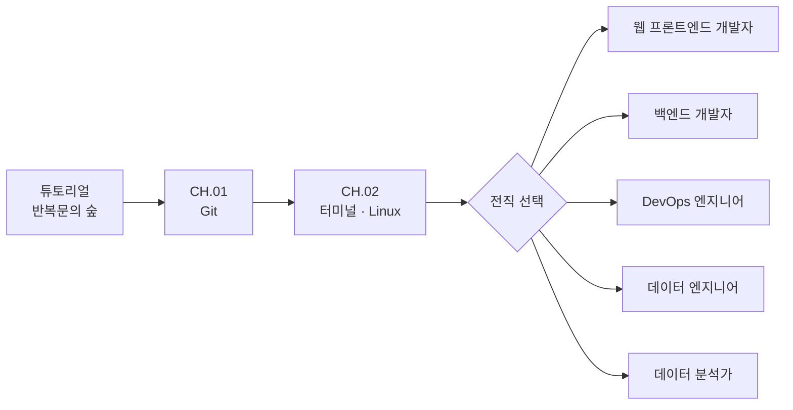
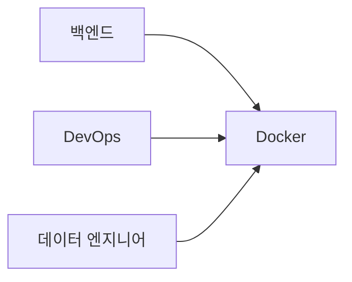

# Codigdex 직업 전직 Path 설계

Codigdex의 학습 여정은 **튜토리얼 → 주니어 공통 과정 → 직업 전직 → 직업별 전문 과정** 순서로 진행한다. 이 문서는 게임 콘텐츠를 확장할 때의 기준이자, 개발자 교육 로드맵을 소개하는 블로그 글의 기초 자료로 사용한다.

## 전체 구조



튜토리얼은 정규 챕터가 아니다. 반복문 문제를 통해 퀘스트, 코드 배틀, 캡처 퀴즈, 도감 등록이라는 게임의 핵심 루프를 먼저 경험하게 한다. 정규 커리큘럼의 시작은 `CH.01 Git`이다.

## 주니어 공통 과정

| 순서 | 과정 | 공통으로 배우는 이유 |
|---|---|---|
| CH.01 | Git | 변경 이력 관리, 협업, 복구는 모든 개발 직군의 기본 역량이다. |
| CH.02 | 터미널 · Linux | 파일, 경로, 프로세스, 명령 실행을 이해해야 이후 개발 도구를 스스로 다룰 수 있다. |
| 전직 | 직업 선택 | 최소 공통 기반을 갖춘 뒤 관심 직무의 전문 과정으로 진입한다. |

공통 과정은 짧게 유지한다. 모든 기술을 전직 조건으로 만들면 플레이어가 관심 직무를 만나기 전에 지칠 수 있기 때문이다.

### 챕터 안의 단계

공통 과정의 각 챕터는 몬스터 한 마리가 아니라 **Lv.1~Lv.5 다섯 단계**로 이뤄진다. 앞 단계를 포획해야 다음 단계가 열리고, 마지막 단계를 포획하면 다음 챕터가 열린다. 단계마다 도감 한 칸과 주제별 문제 20개가 있으며, 레벨이 오를수록 한 번의 배틀에서 뽑는 문제가 늘어난다(Lv.1 3문제 → Lv.5 7문제). 뽑힌 문제 중 60% 이상(소수점 올림)을 맞히면 포획되며, 목표 정답 수에 도달하는 즉시 배틀이 끝난다(Lv.1 2/3 · Lv.2 3/4 · Lv.3 3/5 · Lv.4 4/6 · Lv.5 5/7). 모든 문제를 맞혀야 하는 방식은 입문자에게 한 번의 실수가 곧 실패가 되어 지나치게 어렵기 때문이다.

| 챕터 | Lv.1 | Lv.2 | Lv.3 | Lv.4 | Lv.5 |
|---|---|---|---|---|---|
| CH.01 Git | 깃새싹 · 저장소 기초 | 브랜치 쌍둥이 · branch와 merge | 충돌 되돌이 · 충돌과 되돌리기 | 원격 리베이서 · 원격과 rebase | 워크플로 수호자 · PR·리뷰·CI |
| CH.02 Linux | 셸 탐험가 · 셸 기초 | 경로 채집가 · 경로와 파일 | 권한 수호병 · 권한과 사용자 | 파이프 엔지니어 · 파이프와 프로세스 | 커널 수호자 · 커널과 부팅 |

챕터 표본(`git-specimen`, `linux-specimen`)은 Path 맵에서 챕터를 대표하는 아이콘으로 쓰고, 배틀에는 단계별 몬스터가 등장한다.

## Docker를 공통 필수에서 제외하는 이유

Docker는 중요한 기술이지만 모든 입문 직군이 같은 시점과 깊이로 배워야 하는 기초는 아니다. 컨테이너는 터미널, 프로세스, 네트워크, 서버 실행에 대한 이해가 있을 때 학습 효과가 높다.

따라서 Docker는 전직 이후 여러 직업이 다시 만나는 **공유 전문 기술 노드**로 설계한다.



프론트엔드 개발자와 데이터 분석가도 필요에 따라 Docker를 선택 학습할 수 있지만, 전직을 막는 필수 조건으로 사용하지 않는다.

## 직업별 초반 로드맵

| 직업 | 권장 진행 순서 |
|---|---|
| 웹 프론트엔드 개발자 | HTML/CSS → JavaScript/TypeScript → 브라우저·HTTP → React → 프론트엔드 테스트 |
| 백엔드 개발자 | HTTP/API → 서버 프레임워크 → 데이터베이스·SQL → 인증·보안 → Docker |
| DevOps 엔지니어 | Linux 심화 → 네트워크 → Docker → CI/CD → 클라우드·IaC → 모니터링 |
| 데이터 엔지니어 | Python·SQL → 데이터 모델링 → 데이터 파이프라인 → Docker → 워크플로 오케스트레이션 |
| 데이터 분석가 | SQL → 기초 통계 → 데이터 시각화 → BI 도구 → 분석용 Python |

### 맵의 깊이와 이동

Path 화면과 플레이 지역은 같은 화면이 아니다. 상위 Path는 공통 과정과 전직 관계를 보여 주는 진로도이고, 1차 직업 카드를 선택하면 해당 직업의 **상세 지도**로 이동한다. 상세 지도 위의 기술 거점(HTML/CSS, Docker, SQL 등)을 선택하면 몬스터를 포획하는 개별 챕터 지역으로 들어간다.

```text
진로 Path → 직업별 상세 지도 → 기술 챕터 지역 → 배틀/포획
```

직업별 월페이퍼에는 이동 경로와 거점이 그려져 있고, 게임 UI는 번호 원판 대신 각 건물·섬의 실제 경계에 맞춘 개별 다각형 포커스와 기술명을 표시한다. 평상시 포커스 윤곽은 숨겨 두고 해당 구역에 마우스를 올렸을 때만 윤곽과 반투명 채움을 표시하며, 그 영역 전체를 클릭 대상으로 사용한다. 따라서 새 챕터를 추가할 때는 상위 Path를 다시 그리는 대신 상세 지도 데이터에 목적지의 포커스 영역을 추가하고, 그 목적지를 챕터 지역과 연결한다.

전직 전 공통 과정은 버그 연구원 루피가 안내한다. 전직 후 상세 지도에서는 직업 초상을 활용한 직업별 선배 NPC가 안내를 이어받는다. 직업을 바꾸면 저장된 1차 직업과 함께 지도·NPC가 즉시 교체된다.

## 직업 사이의 공유 기술

직업 Path는 완전히 분리된 다섯 개의 선이 아니다. 같은 기술을 서로 다른 맥락에서 만나는 교차형 트리다.

| 공유 기술 | 연결되는 주요 직업 |
|---|---|
| HTTP · API | 웹 프론트엔드, 백엔드 |
| SQL · 데이터베이스 | 백엔드, 데이터 엔지니어, 데이터 분석가 |
| Docker | 백엔드, DevOps, 데이터 엔지니어 |
| 클라우드 | 백엔드, DevOps, 데이터 엔지니어 |
| 테스트 · 관찰 가능성 | 웹 프론트엔드, 백엔드, DevOps |

공유 노드를 먼저 완료한 플레이어가 다른 직업으로 전직하면 해당 카드를 유지하게 한다. 이렇게 하면 재학습을 강요하지 않으면서 다른 직무를 탐색하는 동기가 생긴다.

## 2차 전직 (하이브리드 직업)

1차 직업 경로 두 개를 완료하면 두 분야를 잇는 2차 직업이 열린다. 공유 카드를 유지하는 규칙과 이어져, 한 직업을 끝낸 플레이어가 다른 직업을 탐색할 동기가 된다. 콘텐츠는 필요한 1차 경로가 완성된 뒤 구성한다.

한 번 1차 직업을 선택하면 해당 직업 경로의 모든 챕터를 완료하기 전에는 다른 1차 직업으로 변경할 수 없다. 현재 경로를 완주하면 다른 1차 직업 선택이 열리고, 두 번째 경로도 같은 방식으로 완주해야 두 경로를 요구하는 2차 직업 조건을 충족한다. 경로 완료 여부는 각 전문 챕터의 최종 포획 기록으로 계산한다.

Path 계층은 화면 왼쪽부터 **전직 전 주니어 개발자 → 1차 직업 → 2차 직업**의 세 열로 표시한다. 주니어 개발자 카드에서 모든 1차 직업으로 선이 갈라지고, 각 1차 직업은 조합 가능한 2차 직업으로 이어진다. 완료한 1차 직업 집합과 각 2차 직업의 `requires` 조합을 비교해 두 경로가 모두 끝난 경우에만 이름과 선택 기능을 공개한다. 예를 들어 프론트엔드와 백엔드를 모두 완료하면 풀스택 엔지니어가 열리지만, DevOps까지 완료하지 않았다면 플랫폼 엔지니어/SRE는 계속 잠긴다.

| 2차 직업 | 해금 조건 | 통합 챕터에서 다룰 흐름 (예시) |
|---|---|---|
| 플랫폼 엔지니어 / SRE | DevOps + 백엔드 | 서비스 배포 파이프라인, 관찰 가능성, 장애 대응 |
| MLOps · 데이터 플랫폼 엔지니어 | DevOps + 데이터 엔지니어 | 파이프라인 컨테이너화, 스케줄링, 모니터링 |
| ML Developer | 백엔드 + 데이터 엔지니어 | 모델 서빙, 추론 API, 데이터·모델 파이프라인 |
| 풀스택 엔지니어 | 웹 프론트엔드 + 백엔드 | 화면과 API 연결, 인증, 배포 |
| 분석 엔지니어 | 데이터 엔지니어 + 데이터 분석가 | 데이터 모델링, 변환, 지표 정의 |

- **조합은 실제 직무명이 있는 것만 둔다.** 1차 직업 5개의 모든 조합(10가지)을 만들면 콘텐츠만 늘고 직업의 의미가 흐려진다.
- **도감식 실루엣으로 공개한다.** 경로 맵에 `???` 실루엣으로 존재만 보여 주고, 첫 직업 경로를 완료하면 해금 조건 힌트를 공개한다. 완전히 숨기면 존재를 몰라 동기가 생기지 않는다.
- **미래 몬스터도 도감에 자리를 잡는다.** 아직 배틀과 퀴즈가 없는 전문 챕터는 번호와 `???`만 표시한다. 출시 전 슬롯은 현재 도감의 전체 수·완성률 계산에서 제외한다.
- **칭호만 주지 않는다.** 두 분야를 잇는 5단계 통합 챕터, 전용 초상 아트, 도감 배지를 함께 제공한다.
- **해금 조건은 포획 기록에서 계산한다.** 직업 경로 완료 여부를 별도 플래그로 저장하지 않는다. 저장 v2에는 선택된 2차·3차 직업을 기록하되, 실제 해금 여부는 언제나 도감에서 다시 계산한다.

## 3차 전직 (마스터 직업)

3차 전직은 또 다른 직업 조합을 요구하지 않고, 선택한 2차 직업의 마스터 경로와 최종 프로젝트를 완료하면 열린다. Path 상세 화면은 선택한 2차 직업 아래에 연결된 3차 직업 하나만 펼쳐 연결선이 다시 복잡해지지 않게 한다.

| 2차 직업 | 3차 직업 |
|---|---|
| 풀스택 엔지니어 | 소프트웨어 아키텍트 |
| 플랫폼 엔지니어 / SRE | 클라우드 플랫폼 아키텍트 |
| ML Developer | AI 프로덕트 엔지니어 |
| MLOps 엔지니어 | AI 플랫폼 아키텍트 |
| 분석 엔지니어 | 데이터 아키텍트 |

## 저장 구조

브라우저 저장은 변경이 잦은 화면 상태를 한 객체에 평평하게 쌓지 않고 `progress`, `player`, `ui`로 나눈다.

- `progress`: 몬스터 ID와 포획 시각. 카드 표시 정보와 Path 완료 여부는 현재 콘텐츠 정의에서 다시 계산한다.
- `player`: 선택한 1차·2차·3차 직업.
- `ui`: 튜토리얼 안내 확인처럼 진행과 직접 관련 없는 화면 상태.

기존 `codigdex:save:v1`은 첫 로드 때 v2 구조로 복사한다. 구버전 슬롯은 마이그레이션 안전망으로 유지하며, 새 게임 초기화 시 두 슬롯을 함께 정리한다.

직업 제작 순서(DevOps → 백엔드 → 데이터 엔지니어 → 웹 프론트엔드 → 데이터 분석가)를 따르면 플랫폼 엔지니어가 가장 먼저(백엔드 경로 완성 시) 열리고, 풀스택 엔지니어는 웹 프론트엔드 경로가 완성된 뒤 열린다.

## 기술 개체 디자인 기준

기술 이름을 로고처럼 붙이는 대신, 기술의 대표 개념을 도감에서 기억할 수 있는 생물 실루엣으로 바꾼다. 기존 블로그의 Git 개체를 시각적 기준점으로 삼아 굵은 어두운 외곽선, 따뜻한 크림색, Git 오렌지 포인트, 작은 흰색 눈을 공통 문법으로 사용한다.

| 기술 | 캐릭터 원형 | 기억할 개념 |
|---|---|---|
| Git | 가지와 노드가 자라는 주황색 생물 | 브랜치, 커밋, 병합 |
| 터미널 · Linux | 명령 패널을 단 펭귄 탐험가 | 셸, 명령 실행, 운영체제 |
| Docker | 컨테이너 세 개를 운반하는 고래 | 이미지, 컨테이너, 격리 |
| CI/CD | 상태등과 순환 팔을 가진 릴레이 러너 | 자동화, 파이프라인, 피드백 |
| Kubernetes | 세 개의 Pod를 지휘하는 클러스터 조타수 | 배치, 조율, 복구 |
| HTML/CSS | 벽돌과 색상 판을 조립하는 아르마딜로 | 구조, 스타일, 레이아웃 |
| JavaScript | 코드 꼬리에 전류가 흐르는 반딧불 여우 | 동작, 이벤트, 상태 변화 |
| HTTP/API | 요청 편지를 주고받는 두 머리 전령새 | 요청, 응답, 인터페이스 |
| SQL | 테이블 서랍을 멘 기록관 두더지 | 조회, 관계, 데이터 정리 |
| Python | 두루마리를 연구하는 뱀 학자 | 자동화, 데이터 처리, 범용 문법 |
| 네트워크 | 세 개의 신호 노드를 연결하는 케이블 게 | 연결, 주소, 패킷 |
| 테스트 | 버그의 흔적을 찾는 탐정 딱정벌레 | 검증, 회귀 방지, 신뢰성 |
| 보안 · 인증 | 열쇠 꼬리와 겹갑옷을 가진 천산갑 수호자 | 신원, 권한, 보호 |
| Cloud · IaC | 설계도로 인프라 블록을 배치하는 구름 골렘 | 선언, 자동 구성, 확장 |
| 모니터링 | 망원경 눈과 상태 깃털을 가진 관측 올빼미 | 상태, 지표, 이상 감지 |

Linux 펭귄과 Docker 고래처럼 널리 알려진 상징은 학습자가 기술을 즉시 알아보는 출발점으로만 사용한다. 공식 마스코트나 로고를 그대로 복제하지 않고, 장비·자세·색상과 게임 세계관을 더해 Codigdex 고유 개체로 발전시킨다.

## 블로그용 핵심 요약

> 처음에는 Git과 Docker를 모든 직업의 공통 과정으로 묶었다. 하지만 Docker는 터미널, 프로세스, 네트워크 같은 선행 지식이 있어야 제대로 이해할 수 있고 직업마다 필요한 시점도 달랐다. 그래서 공통 과정은 Git과 터미널·Linux로 최소화하고, Docker는 백엔드·DevOps·데이터 엔지니어가 전직 후 다시 만나는 공유 전문 기술로 옮겼다. 이 구조는 입문자의 초기 부담을 줄이면서 직업 간 기술의 연결 관계도 보여준다.
